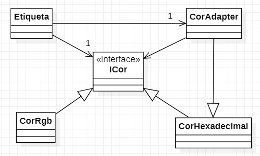

# Padrão Adapter

Usado quando se precisa converter tipos de classe.

**Caso de Uso**: Sistema que recebe cor de uma API para customizar uma etiqueta de um elemento na tela.  
Apenas as cores: Vermelho, Azul, Amarelo, Branco, Preto e Verde

Diagrama de classes  
